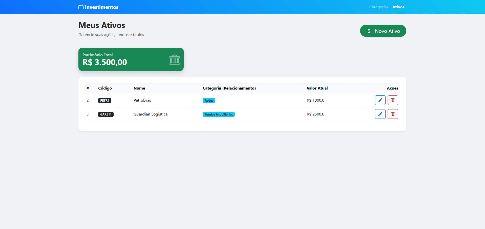
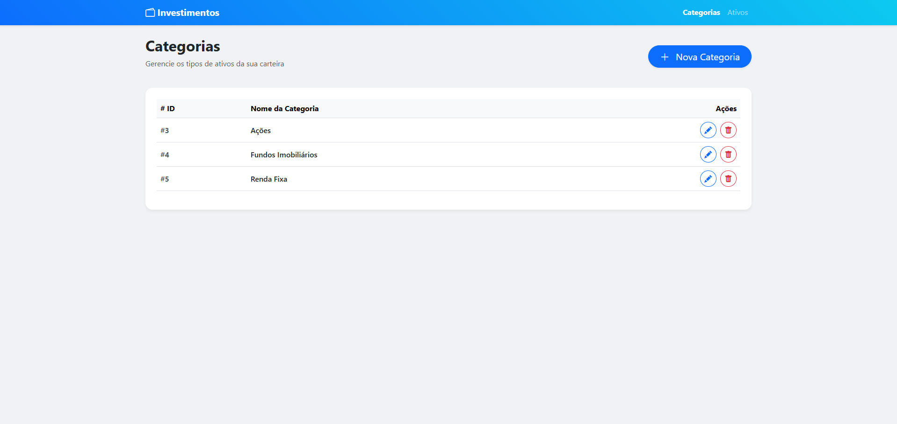

# 💰 Carteira de Investimentos (Investment Wallet)

Sistema web monolítico para gestão pessoal de ativos financeiros. O projeto permite o cadastro, categorização e acompanhamento do valor total da carteira em tempo real.

Desenvolvido como projeto prático para consolidar conhecimentos em **Java Backend**, **ORM** e **MVC**.


## 📸 Screenshots

| Dashboard de Ativos | Formulário de Cadastro |
|:---:|:---:|
|  |  |
> *Preview da interface com Bootstrap 5 e Thymeleaf.*

## 🛠 Tecnologias Utilizadas

* **Java 21** (LTS)
* **Spring Boot 3** (Web, Data JPA, Validation)
* **Hibernate** (ORM e mapeamento de entidades)
* **MySQL 8** (Banco de dados relacional)
* **Thymeleaf** (Template engine para renderização server-side)
* **Bootstrap 5** (Framework CSS para interface responsiva)
* **Maven** (Gerenciamento de dependências)

## 🚀 Funcionalidades

* **CRUD Completo de Categorias:** Criação, leitura, edição e exclusão de tipos de investimento (ex: Ações, FIIs, Renda Fixa).
* **CRUD Completo de Ativos:** Gestão dos ativos com vínculo obrigatório a uma categoria.
* **Relacionamento 1:N:** Implementação técnica de relacionamento Um-para-Muitos entre Categoria e Ativos.
* **Dashboard Financeiro:** Card de destaque com cálculo automático do patrimônio total somado via Backend.
* **Dropdown Dinâmico:** O formulário de ativos busca as categorias disponíveis no banco em tempo real.
* **Tratamento de Exceções:** Validações básicas e proteção contra exclusão de categorias com dependências.

## 🗂 Estrutura do Projeto (MVC)

O código segue o padrão de arquitetura em camadas:

* `model`: Entidades JPA (`Categoria`, `Ativo`) espelhando as tabelas do MySQL.
* `repository`: Interfaces que estendem `JpaRepository` para abstração do SQL.
* `controller`: Classes que gerenciam as requisições HTTP e entregam as Views.
* `resources/templates`: Páginas HTML processadas pelo Thymeleaf.

## ⚙️ Como executar localmente

### Pré-requisitos
* Java JDK 17 ou superior instalado.
* MySQL rodando na porta 3306.
* Maven.

### Passo a passo

1.  **Clone o repositório**
    ```bash
    git clone [https://github.com/seu-usuario/carteira-investimentos.git](https://github.com/seu-usuario/carteira-investimentos.git)
    ```

2.  **Configure o Banco de Dados**
    Crie um schema no seu MySQL:
    ```sql
    CREATE DATABASE carteira_investimentos;
    ```
    *No arquivo `application.properties`, ajuste o `username` e `password` do seu banco local.*

3.  **Execute o projeto**
    Via terminal na pasta raiz:
    ```bash
    mvn spring-boot:run
    ```

4.  **Acesse**
    Abra o navegador em: `http://localhost:8080/ativos`

## 🔮 Melhorias Futuras

* [ ] Implementar paginação nas tabelas (Spring Pageable).
* [ ] Adicionar gráficos com Chart.js para distribuição da carteira.
* [ ] Criar camada de Segurança (Spring Security) com Login.
* [ ] API Rest separada para consumo mobile.

---
Desenvolvido por **Alexandre Siqueira**.
